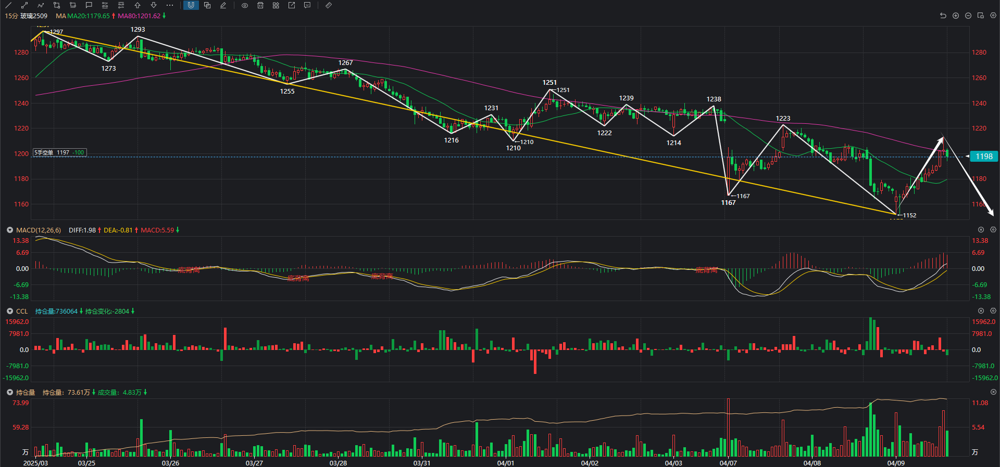
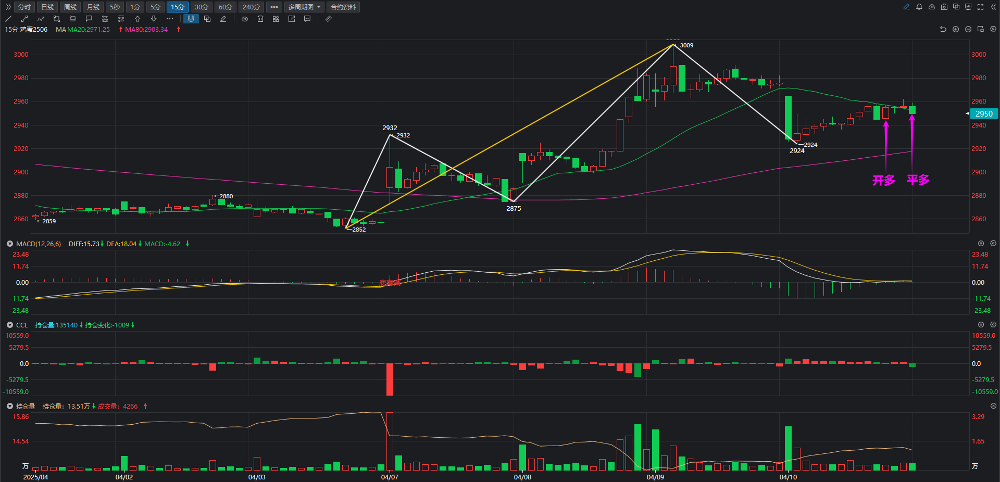
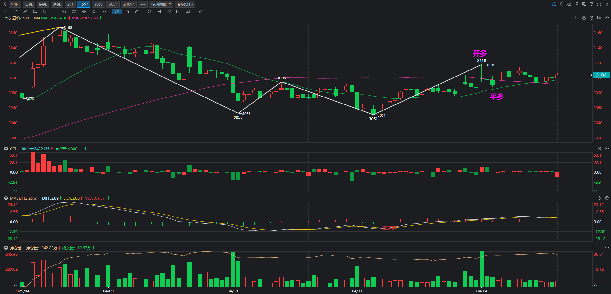
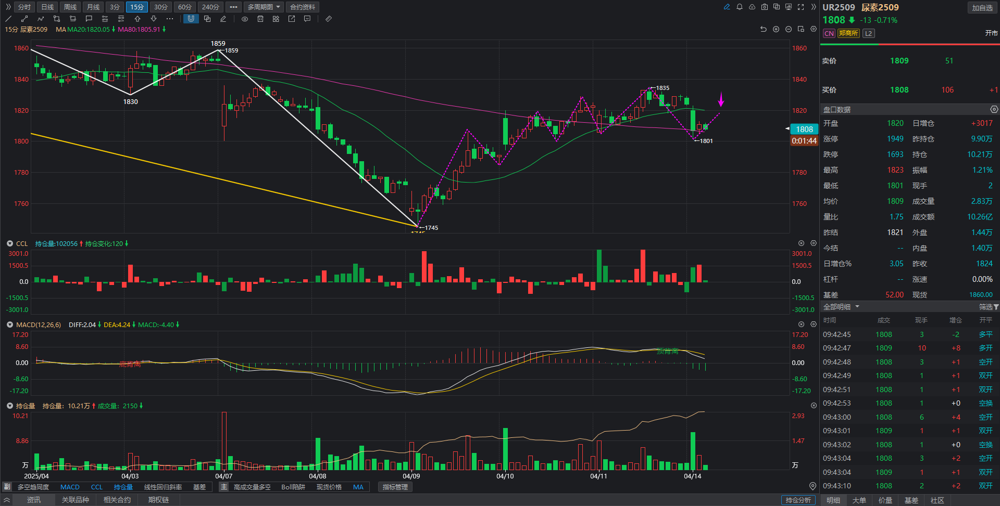
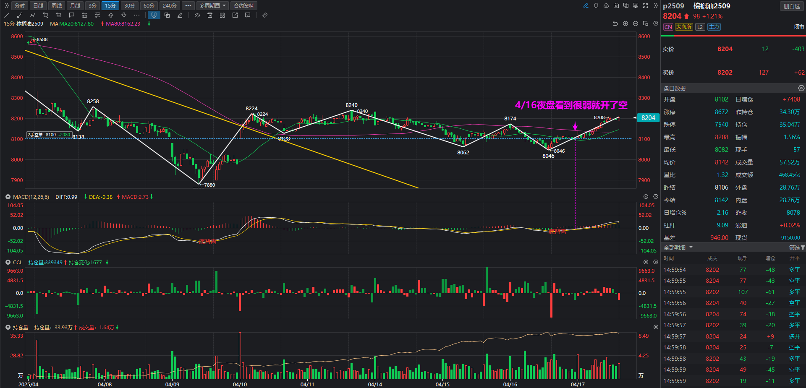
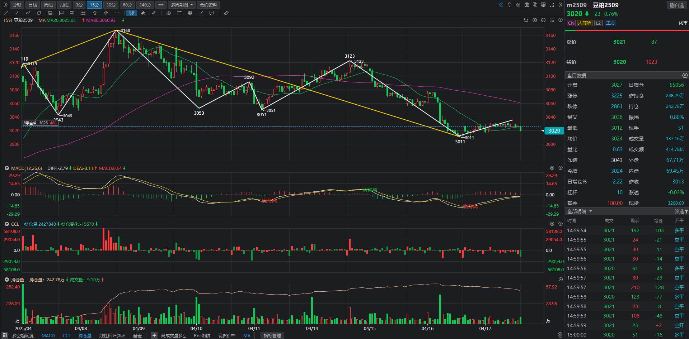

## 交易汇总

| 交易合约 | 方向 | 开仓时间  | 平仓时间  | 开仓价格 | 平仓价格 | 手数 | 盈亏 | 操作评价                                            |
| ---------- | --------- | --------- | -------- | -------- | ---- | ---- | ---------------------------- | ---------------------------- |
| 玻璃2509   | 空       | 2025/4/9  | 2025/4/16 | 1197     | 1180 | 6    |      | 持仓一周，盈利没有多大，一直震荡就平仓离场了 |
| 鸡蛋2506   | 多       | 2025/4/10 | 2025/4/10 | 2947     | 2953     | 10   | 600  | 买入后没有遵守交易系统，倒在黎明前 |
| 铁矿石2509 | 空       | 2025/4/11 | 2025/4/11 | 699.5    | 710.5    | 3    | -3300 | 情绪化操作，买入位置太早，没有用区间套去找15F次级别 |
| 豆油2509   | 空       | 2025/4/11 | 2025/4/11 | 7678     | 7696 | 6    | -1080 | 通过MACD死叉开仓，开仓过早 |
| 铁矿石2509 | 空       | 2025/4/14 | 2025/4/14 | 704.5 | 710 | 5 | -2750 | 情绪化操作，没有遵守交易系统 |
| 豆粕2509   | 多       | 2025/4/14 | 2025/4/14 | 3111     | 3090   | 14 | -2940 | 情绪化操作，没有遵守交易系统 |
| 尿素2509   | 空       | 2025/4/14 | 2025/4/16 | 1806 | 1772 | 10 | 6800 | 操作正确 |
| 棕榈油2509 | 空 | 2025/4/16 | 2025/4/16 | 8100 |  | 2 |  |  |
| 豆粕2509 | 空 | 2025/4/16 | 2025/4/16 | 3026 |  | 8 |  |  |

## 盘中操作

### 玻璃2509 开空 2025/4/9

下午快收盘时候开仓玻璃空单。

### 鸡蛋2506 开多 2025/4/10

今天开仓了鸡蛋多单，但下午没咋动，就在快收盘时候平仓跑路了。

### 豆粕2509 开多+平今多 2025/4/14

豆粕是周日看到华北现货涨价的消息就开盘追多了，然后突然就下来了，然后早上就平仓了。

### 尿素2509 开空 2025/4/14

早盘时候看到尿素15F次级别有形成二卖迹象，就择机开了空，开仓价格1806。

### 棕榈油2509 开空 2025/4/16

4/16夜盘看到15F的MACD红柱快死叉了，于是就开空了，现在来看是开早了，因为没有碰到8258位置，因此这里继续持仓，当作空头趋势看待。

### 豆粕2509 开空 2025/4/17

豆粕这里60F整体是下跌趋势，当前位置是15F级别上涨不今日中枢的三卖点，因此开仓做空了。

