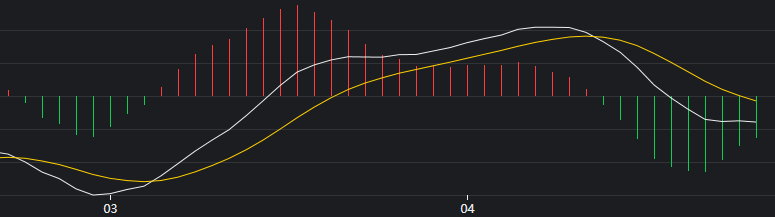
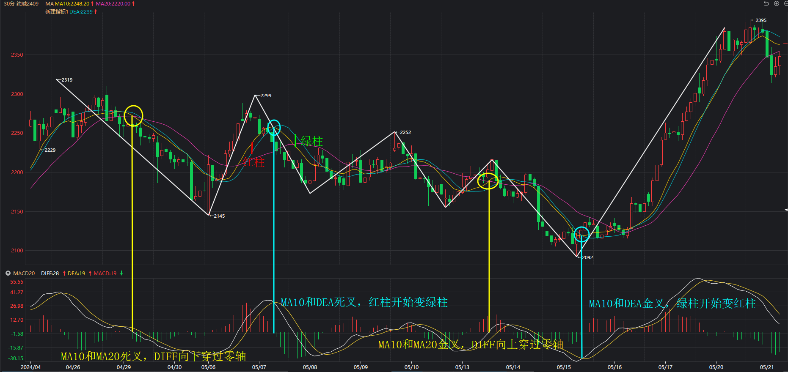

## MACD的定义

```
DIFF:EMA(CLOSE,SHORT)-EMA(CLOSE,LONG);
DEA:EMA(DIFF,M);
MACD:(DIFF-DEA)*2,COLORSTICK;
```


EMA：某段时间内收盘价的平均值。

DIFF（白线）：短期收盘价平均值 - 长期收盘价平均值。

DEA（黄线）：某段时间内DIFF的平均值，即短期长期收盘价差平均值的平均值。



根据图中可以观察到，红绿柱高度其实就是白线和黄线差值形成的。

- 白线低于黄线：差值为负数，因此形成绿色柱子。
- 白线高于黄线：差值为整数，因此形成红色柱子。
- 金叉、死叉：差值为0，因此柱子高度为0。

## MACD指标的含义

以 SHORT=10、LONG=20、M=5 为例。

MACD 的零轴本质上就是**被拉平的EMA20**，白色线就是EMA10。DIFF 表现的是 EMA10 相对于 EMA20 的聚合与发散情况。

1.DIFF 的方向

EMA20 被当作拉平的零轴后，DIFF 其实就是 EMA10，那么 DIFF 的方向其实就是 EMA10 的方向，即**当前一笔正在构筑的方向**。

这一笔构筑是否成功，必须要等DIFF穿过零轴才能判定。

2.DIFF 相对零轴的位置

- DIFF 在零轴之上（正值）：EMA10 大于 EMA20，当前处于上涨一笔，但这一笔是否结束还未判定。
- DIFF 在零轴之下（负值）：EMA10 小于 EMA20，当前处于下跌一笔，但这一笔是否结束还未判定。

3.DIFF 上下穿零轴

通过 DIFF 的值为正为负就能简单粗暴的分辨出处于上涨还是下跌状态，那么可以进一步得到上穿下穿零轴时候对上涨下跌走势的划分：

- DIFF 上穿零轴：EMA10 和 EMA20 形成金叉，判定之前下跌一笔结束，构筑上涨一笔成功。至于新上涨一笔何时延续到结束，需要观察 DIFF 何时下穿零轴。
- DIFF 下穿零轴：EMA10 和 EMA20 形成死叉，判定之前上涨一笔结束，构筑下跌一笔成功。至于新下跌一笔何时延续到结束，需要观察 DIFF 何时上穿零轴。

4.DIFF 的绝对值

DIFF 绝对值大小代表着 EMA10 偏离 EMA20 的距离，值越大说明偏离的越远，说明短期价格呈现加速上涨或加速下跌状态。

------

DEA 是 DIFF 的均线，意味着对 DIFF 单日变化更迟钝。

- DIFF 在零轴之上

- DIFF 和 DEA 金叉：说明 DIFF 绝对值在变大，即 EMA10 相对于 EMA20 距离变大，说明上涨势头越来越猛。
- DIFF 和 DEA 死叉：说明 DIFF 绝对值在变小，即 EMA10 相对于 EMA20 距离变小，说明上涨势头正在变弱。

- DIFF 在零轴之下

- DIFF 与 DEA 金叉：说明 DIFF 绝对值在变小，即 EMA10 相对于 EMA20 距离变小，说明下跌势头正在变弱。
- DIFF 与 DEA 死叉：说明 DIFF 绝对值在变大，即 EMA10 相对于 EMA20 距离变大，说明下跌势头越来越猛。

红绿柱就是 DIFF 与 DEA 的差值，表现的是 DIFF 相对于 DEA 的聚合与发散情况。

- DIFF 和 DEA 金叉，绿柱变为红柱；DIFF 和 DEA 死叉，红柱变为绿柱。
- 红绿柱高度越来越大：说明 DIFF 和 DEA 距离越来越大，上涨或下跌力度越来越大。
- 红绿柱高度越来越小：说明 DIFF 和 DEA 距离越来越小，上涨或下跌力度越来越小。



## MACD判定转折

**判断走势运动的最关键并不是背驰本身，而是转折，MACD红绿柱缩短，意味着A0级别有可能转折**，但要判定转折，下面两者缺一不可：

1. MACD形成红绿柱背离
2. 当前结构确认结束

前者保证了新的上涨（下跌）一笔相对上一次最近的上涨（下跌）一笔是力竭的，后者要保证了新的一笔一定完结，最终形成结构。


关于条件1的判定就是看MACD的红绿柱就可以了。条件2需要看当前位置是不是在该级别中枢内部，**如果在中枢内部的话，结构还未完成，这时候不一定会转折；如果在中枢外，则往往会构成标准的背驰结构，那么这种情况转折的概率非常大。**

条件2的判断需要等待 DIFF 白线上穿零轴时，然后确认当前结构类型，趋势背驰>盘整背驰>五笔背驰>三笔背驰。

该判断成功后，**至少引起不小于该级别的转折。**

## 小级别MACD金死叉作为开仓信号

上面讲到的MACD背驰导致转折的判定尽管是正确的，但是非常滞后的。在实际操作中，使用小级别 MACD 金死叉作为开仓信号。

**MACD金死叉信号一定出现在新一笔构筑和上一笔结束判定前，且形成金叉和死叉后往往有加速行情。**


使用金死叉作为开仓信号其实是在赌后面走势会延续现在的判断，上图这样的走势也很有可能在经过震荡后继续下跌。

## 问题

### 1.金叉一定做多？死叉一定做空吗？

通过小级别MACD的金死叉可作为开仓点位，但实际操作上还需要考虑当前位置处于大级别何处。如果是大级别上涨尾期，即使出现信号开仓，也很有可能保本或频繁止损。

### 2.如何理解MACD回抽零轴的操作？

MACD 的 DIFF 白线回抽零轴止跌，说明正构筑下跌一笔，但这一笔随着在零轴止跌而构筑失败，反而延续了之前上涨的一笔。而止跌说明这个位置并没有转折，而是上涨的中继位置。