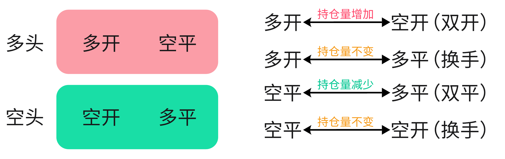

## 交易系统的准则

### 主体和客体

我在从开股票期货账户到现在有一年半了，交易系统迭代了数不尽版本，早期沉迷于缠论技术分析，使用过笔段，后来使用均线，然后使用均线定义笔，各种调整参数，还写过指标，然后亏了很多。

我在技术分析上耽误太多时间，不断的去纠结技术细节，在去年 12 月份棕榈油的一单巨额亏损中，我终于领悟了到底错在哪里。市场是客体，真实的市场就是资金之间的交易，这个过程中价格不断变化，在交易过程中留下了价和量的痕迹，而所谓技术分析是主观性很强的，纠结图形怎么画根本不重要。哪怕把图形画成花儿，难道市场就一定跟着自己画的图形走吗？不会的，市场根本上是真金白银交易，和所谓图形无关。

因此我们说**技术分析是通过主观的方式去描述客观的市场，技术分析的规则完全可以自己定义**。当然，经典的技术分析大都基于价格图形，定义完技术分析的细节后，无论如何定义，都一定存在市场规则突破技术规则的问题。例如震荡区域压力位会被突破后再跌下来，下降趋势线会被跌破后又回升回来，背离规则会出现背了又背。

市场是混沌的，趋势和震荡的界限是非常模糊的，难以用明确的边际规则来定义，很多走势在当下是没法判断出来的，只有行情走出来才知道。因此基于价格图形的技术分析必然是有胜率瓶颈的，这种瓶颈来源于价格图形分析只是基于图形而非市场，因此**基于市场行为的量价分析比价格图形分析更接近市场本质。**

量价行为分析也是主观的，很多地方也有主观猜测的意思，可能真实市场并非这样。量是投入，价是产出。量价分析观察的是关键位置投入和产出的关系，通过异常位置的投入产出关系洞悉市场行为，进而看到整体持仓筹码的变化和主力资金在干啥。

既然技术面本身有问题，那么技术面本身何用？因为市场消息不能及时看到，**技术面定义了规则，就像是一把量尺，能度量走势的情况，进而设置开仓止损位，另一方面能及时看到走势变动的情况。**

独立于传统技术面的是资金面分析，这块是通过量价分析和每日龙虎榜持仓分析得来的，但也有很大的局限性，就是必须是投机资金分歧小的趋势行情，这块还在研究中。

最后是基本面和消息，一波趋势行情必然是有现货基本面供求变化驱动的，因为期货价格虽然是资金博弈而来，但没有人敢逆基本面而行，逆基本面而行的操作会引来更大资金的联合绞杀。受国内影响较大的商品，很多是投机资本和现货资本联合坐庄，人为伪造供求关系，他们就是基本面本身，大资金建立好仓位后，释放利多利空消息，进行标的洗盘、拉升、出货操作；而受外盘影响较大的商品，鞭长莫及没法操控，更要顺基本面。因此，**无论是伪造的基本面还是真实的基本面，资金都要顺基本面方向操作**。但基本面和消息，作为散户不一定看得到，这些东西的获取，需要有小道消息。

### 各类分析方法优先级

所有的分析，无论是哪种，无论是基于盘面还是基本面，最终都要有资金操作才行，可以说：，资金在哪，就要往哪个方向做。

下面会提到四个分析角度，按照优先级依次排序：

1. 收盘席位净持仓分析
2. 基于成交量、持仓量的分析
3. 基于缠论的价格图形分析
4. 基本面分析

## 基于缠论的价格图形分析

### 分型和K线包含

### 笔的定义

### 转折和线段定义

### 关键价位

#### 波段高低点

#### 震荡区间上下沿

### 背驰

#### 背驰类型

1.盘整背驰

2.趋势背驰

#### 区间套

#### 背驰的使用风险

### 小转大

### 均线的辅助

## 基于成交量、持仓量的分析

### 多空操作对持仓量影响

两边都开仓时候持仓量才会增加，两边都平仓时候持仓量才会减少，其他情况持仓量不变。

### 量价分析的一些问题

1.到底在哪个级别观察K线进行量价分析呢？

级别是人为主观定义的概念，真实市场的波动是波动的大小区别，因此市场更本质的量价分析也是无须考虑级别。在不同周期去观察，看到的信息粗细不同，周期越小对市场行为分析越精细，周期越大则会忽略一些细节，**大小级别看到的结果是统一的。**

2.量价分析到底分析的是啥？

分析的价格不一定是K线形态，而是**关键位置由于量造成价格变化的逻辑**，因此每天的分时图也是可以分析的，任何周期图也是可以分析的。量价的分析也不是看单K线，看一段时间K线价格变化逻辑也是可以的。

3.市场有主力吗？

**一定是有的，否则市场不可能有较长时间的单边趋势**。同时可以从异常情况窥见这点，2025/3/10这天由于中国对加拿大一些农产品加征100%关税，菜粕2505开盘一瞬间涨停，可以看到是8万多手空单平仓造成的，如此大的量并且组织度如此之高，必然是大资金也就是主力行为。

### 盘口和量的关系

### 确定控场资金

### 确定资金施力方向

### 持仓量随价格变化的几种情况

1.持仓量连续增加或连续减少，价格单边

这是最容易辨识的一种情况，持仓量变化有连续性。增仓上涨说明多头资金入场，减仓下跌说明多头资金离场，增仓下跌说明空头资金入场，减仓上涨说明空头资金离场。

2.持仓量变动不大，价格单边

持仓量整体变动不大，增仓减仓反反复复，但价格单边运行，说明某方力量离场的同时又有另一方力量入场。这种情况往往是资金逐步反手，在反手的最后阶段，持仓量会出现快速减少又增加的情况。由于是原有力量离场和新力量入场，价格大概率单边运行很久一段时间。

3.持仓量连续增加，价格震荡

持仓量不断增加但价格维持小幅震荡，这是资金在增仓筹码，价格有一天会突破震荡区间转化为单边运行。资金的建仓方向可以通过小级别的资金行为分析，也可通过收盘席位净持仓分析。

4.持仓量连续减少，价格震荡

持仓量不断减少但价格维持震荡，常见于趋势行情末期，资金在震荡区间兑现盈利的筹码。

5.持仓量几乎不变，价格震荡

5.1.持仓量变动不大，价格震荡区间不大

持仓量和价格变动都不大，说明市场处于静止行情，资金在这段时间内进行筹码交换，这时候要关注收盘席位净持仓变化情况。

5.2.持仓量整体变动不大，但增仓减仓反反复复，价格震荡区间较大

这是洗盘的迹象，较宽幅的价格震荡区间会吸引很多多空筹码入场，然后入场筹码会反复打止损，旧的筹码会对行情失去耐心而离场。

6.持仓量几乎不变，成交量很大

## 收盘席位净持仓分析

## 基本面分析

### 市场消息

### 需求、供给、库存

## 微观操作

### 背驰和量的结合使用

### 止盈止损

## 风险控制

### 政策带来的异动

### 仓位控制

### 特殊平仓时机

## 多品种投机

### 多品种投机原理

对任何一个品种，它肯定有容易操作的时候，也有难操作的了时候。所谓容易，就是该品种会走较久的单边趋势行情，这种情况操作哪怕错过较好的开仓位置，后续也能赚钱；所谓困难，就是该品种在几天时间内反反复复震荡，操作会屡次打止损，持仓几天也没有利润。

，品种选对了哪怕买卖点有偏差，也有可能是赚钱的。选错了品种就会陷入被动的扛单，不仅会浮亏还会浪费操作其他品种的机会。

### 多品种投机的三步骤

#### 1.根据图形筛选品种机会

#### 2.资金一致性分析

#### 3.查找品种市场消息

