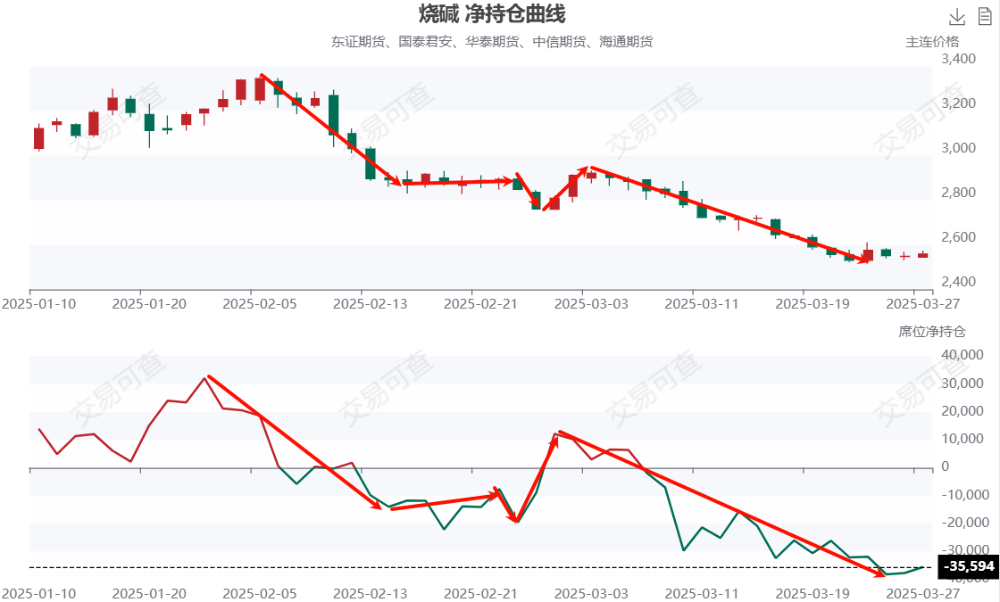

## 机会复盘的缘由

同一个品种在不同时机操作所获得的利润是不同的，目标是做 60F 一笔，但有的走的远有的几乎没动，那么结果自然不同了。下面是 JM2505 和 p2505 合约走势，可以看到在不同时间操作获取利润难度和大小均不同。

一个 60F 波段，能有 5% 以上就是很不错的了，小于 4% 的操作就不是太容易了，因为不可能波段顶底位置开平仓，哪怕操作成功也是小赚，遇上时间较久的横盘震荡，就会浪费大量时间在里面。

## 2月和3月的机会

### 1/24~2/12 棕榈油2505

> 波段时长：8个交易日
>
> 整体幅度：12.1%
>
> 操作预期幅度：7.1%

棕榈油在前面整体是日线级别下跌趋势，因此这里要判断日线趋势转折，收盘价要高于前 60F 波段高点，因此实际开多位置大概会在 15F 类二买位置，然后一直拿着直到三买后出现背驰时平多。

这波上涨是受到印尼B40政策实施预期，主要是外资推动的，可以看到外资席位不断增仓做多，棕榈油价格随之上涨。

### 2/10~2/17 烧碱2505

> 波段时长：5个交易日
>
> 整体幅度：14.0%
>
> 操作预期幅度：13.0%或8.2%

烧碱前面是维持一个月的上涨趋势，在2/7这天有北方大型氧化铝厂停产的消息。2/10为60F二卖位置，2/12为60F下跌回调后第2次开空机会，一直拿到15F出现五笔背驰。

主力机构在1月份是做多烧碱的，紧接着2/4和2/5机构开始平仓多单，此时仍维持价格没变，随后几天多单大量离场，说明此时机构在维持价格同时兑现筹码，烧碱日线级别上涨到顶了。

### 2/7~2/14 焦煤2505

> 波段时长：6个交易日
>
> 整体幅度：8.5%
>
> 操作预期幅度：6.7%

焦煤日线级别是下跌趋势，这里等60F向上回升结束后在15F二卖位置开空，直到出现背驰时候平仓。

在这个时间内机构持续加空，焦煤价格迎来一段不错的下跌。

### 2/11~3/5 燃油2505

> 波段时长：17个交易日
>
> 整体幅度：15.8%
>
> 操作预期幅度：11%

60F级别二卖位置开空，然后观察收盘净持仓变化情况，在3/11时候机构大量空单离场，这时候就是平空时机。

这段时间内机构大量平多，有些甚至反手做空，燃油价格随之而下跌。

### 2/6~3/10 玻璃2505

> 波段时长：30个交易日
>
> 整体幅度：22.9%
>
> 操作预期幅度：14.8%

玻璃由于较差的基本面，玻璃迎来了一个月的增仓下跌，在这么久的时间里，何时操作都是赚钱的。

机构持续加空，玻璃价格不断下跌。

### 2/21~3/5 棕榈油2505

> 波段时长：8个交易日
>
> 整体幅度：7.2%
>
> 操作预期幅度：5%

由于印尼B40政策推迟，对棕榈油是利空，先前持仓棕榈油多单的外资机构纷纷平仓跑路，棕榈油价格开始下跌。

可以看到外资净多单持仓不断减少，说明是平多离场了，价格下跌。

### 2/21~3/10 铁矿石2505

> 波段时长：12个交易日
>
> 整体幅度：9.1%
>
> 操作预期幅度：6.1%

铁矿石在2月上涨后迎来了利空消息，在2/21开启下跌，盘面上持仓量不断下降，多单平仓跑路了，所以在下跌早期任意位置开空都是可以的。

先前在铁矿石外资大量做多，随后在2/11开始平多，价格开始下跌。

### 2/20~3/21 豆一2505

> 波段一时长：9个交易日
>
> 整体幅度：7.4%
>
> 操作预期幅度：3.6%
>
> 波段二时长：14个交易日
>
> 整体幅度：10.4%
>
> 操作预期幅度：7.4%

豆一在2月下旬增仓上涨，随后3/3~3/12开启减仓下跌，在3/12~3/21增仓下跌。

可以看到外资净多 持仓先持续增加，然后继续减少，最后反手增仓做空。

### 3/3~3/7 菜粕2505

> 波段时长：4个交易日
>
> 整体幅度：7.6%
>
> 操作预期幅度：6.3%

菜粕在3/3的60F上涨一笔没有突破前高，形成二卖，当前位置开空，持仓量没怎么变化。至于平空时机看多背驰平仓，如果没有平仓这单是亏损的。当然后续空头大量平仓导致的涨停，则和开仓无关了。

可以看到外资净多持仓下降，价格也下降，是多头平仓离场并反手做空导致的。

### 3/3~3/21 烧碱2505

> 波段时长：16个交易日
>
> 整体幅度：13.4%
>
> 操作预期幅度：10.7%

烧碱开空位置是15F二卖点，在盘面只有某小段出现持仓量和价格行为匹配，前半段多头持仓换成空头持仓，后续才有空头增仓。

机构在3/3后平仓了多单，随后反手做空，烧碱价格随之下跌。

### 3/5~3/21 白糖2505

> 波段时长：13个交易日
>
> 整体幅度：4.37%
>
> 操作预期幅度：2.86%

在15F类二买位置开多，在三买后背驰平多，盘面上持仓量是不断增加的，价格随之也上涨。

机构和外资在这段时间持续加仓做多，白糖价格随之上涨。

### 3/14~3/26 尿素2505

> 波段时长：10个交易日
>
> 整体幅度：10.1%
>
> 操作预期幅度：6.2%

尿素在15F二买开多，然后看到有背驰后平多，盘面上看持仓量不断增加且价格上涨，中间有一段多平下跌回调，后续继续增仓上涨。

机构在3/14后净空持仓减少，有些机构平空，有些在开多，最终导致价格持续上涨。

