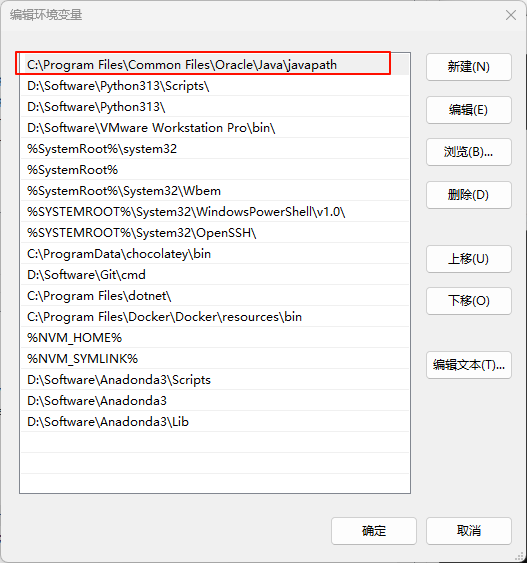

# 一、Java语言概述

## JDK和JRE

JDK（Java Development Kit）：Java程序开发工具包，包含JRE和开发人员使用的工具。

JRE（Java Runtime Environment）：Java程序运行时环境，包含JVM和运行时所需的核心类库。

> JDK=JRE+开发工具集
>
> JRE=JVM+Java SE标准类库

## JDK安装

在官网下载[Java Downloads](https://www.oracle.com/cn/java/technologies/downloads)并按照，会自动配置环境变量，JDK 17后是下面路径。

# 二、万物皆对象

## 对象的概念

